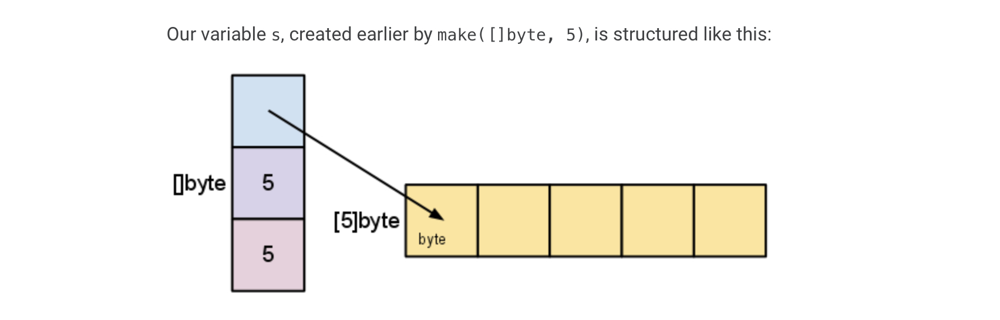
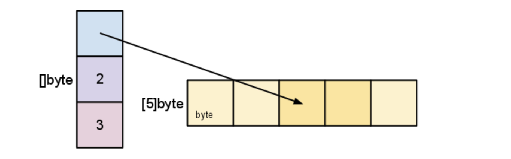

# Golang syntax

## For

Go has only one looping construct, the `for` loop.

No parentheses and the braces are always required.

The init and post statements are optional. C's `while` is spelled `for` in Go.

```go
package main

import "fmt"

func main() {
	sum := 1
	for sum < 1000 {
		sum += sum
	}
	fmt.Println(sum)
}
```

## If

Like `for`, the `if` statement can start with a short statement to execute before the condition.
```go
package main
import "math"
func pow(x, n, lim float64) float64 {
	if v := math.Pow(x, n); v < lim {
		return v
	}
	return lim
}
```

## Switch

Go's switch is like the one in C, C++, Java, JavaScript, and PHP, except that Go only runs the selected case, not all the cases that follow.
In effect, the `break` statement that is needed at the end of each case in those languages is provided automatically in Go.

Go's switch cases need not be constants, and the values involved need not be integers.

Switch without a condition is the same as `switch true`. This construct can be a clean way to write long if-then-else chains.

## Defer

A `defer` statement defers the execution of a function until the surrounding function returns.

The deferred call's arguments are evaluated immediately, but the function call is not executed until the surrounding function returns.

Deferred function calls are pushed onto a stack. When a function returns, its deferred calls are executed in LIFO order.

## Pointers

The `&` operator generates a pointer to its operand.

The `*` operator denotes the pointer's underlying value.

Go has no pointer arithmetic.

## Structs

A `struct` is a collection of fields.
Struct fields are accessed using a dot.

Struct fields can be accessed through a struct pointer.

To access the field `X` of a struct when we have the struct pointer `p` we could write `(*p).X`. However, that notation is cumbersome, so the language permits us instead to write just `p.X`, without the explicit dereference.

A struct literal denotes a newly allocated struct value by listing the values of its fields.
```
var (
	v1 = Vertex{1, 2}	// has type Vertex
	v2 = Vertex{X: 1}	// Y: 0 is implicit
	v3 = Vertex{}		// X: 0 and Y: 0
	p = &Vertex{1, 2}	// has type *Vertex
)
```

## Arrays

The type `[n]T` is an array of `n` values of type `T`.

An array's length is part of its type, so arrays cannot be resized.

Go's arrays are values. An array variable denotes the entire array; it is not a pointer to the first array element (as would be the case in C).
This means that when you assign or pass around an array value you will make a copy of its contents.
One way to think about `array` is as a sort of struct but with indexed rather than named fields: a fixed-size composite value.

An array literal can be specified like so:
```
b := [2]string{"Penn", "Teller"}
```
or let the compiler to count the array elements
```
b := [...]string{"Penn", "Teller"}
```

```
var a [2]string
a[0] = "Hello"
a[1] = "World"
primes := [6]int{2, 3, 5, 7, 11, 13}
```

## Slices

An array has a fixed size. A slice, on the other hand, is a dynamically-sized, flexible view into the elements of an array.
In practice, slices are much more common than arrays.

The type `[]T` is a slice with elements of type `T`.

A slice is formed by specifying two indices, a low and high bound, separated by a colon:
```
a[low : high]
```

A slice does not store any data, it just describes a section of an underlying array.
Changing the elements of a slice modifies the corresponding elements of its underlying array.
Other slices that share the same underlying array will see those changes.

When slicing, you may omit the high or low bounds to use their defaults instead. The default is zero for the low bound and the length of the slice for the high bound.

A slice has both a **length** and a **capacity** (`len(s)` and `cap(s)`).
The length of a slice is the number of elements it contains. The capacity of a slice is the number of elements in the underlying array, counting from the first element in the slice.

Slices can be created with the built-in `make` function; this is how you create dynamically-sized arrays.
The `make` function allocates a zeroed array and returns a slice that refers to that array:
```
a := make([]int, 5)     // len(a) == 5
```
To specify a capacity, pass a third argument to `make`.
```
func make([]T, len, cap) []T
```
When called, `make` allocates an array and returns a slice that refers to that array.

### Slice internals

A slice is a descriptor of an array segment. It consists of a pointer to the array, the length of the segment, and its capacity (the maximum length of the segment).



The length is the number of elements referred to by the slice. The capacity is the number of elements in the underlying array (beginning at the element referred to by the slice pointer).
```
s = s[2:4]
```



Slicing does not copy the slice's data. It creates a new slice value that points to the original array.
This makes slice operations as efficient as manipulating array indices. 
Therefore, modifying the elements (not the slice itself) of a re-slice modifies the elements of the original slice.

A slice cannot be grown beyond its capacity. Attempting to do so will cause a runtime panic, just as when indexing outside the bounds of a lice or array.

To increase the capacity of a slice one must create a new, larger slice and copy the contents of the original slice into it.

Go provides a built-in `append` function that's good for most purposes.
```
func append(s []T, x ...T) []T
```
The `append` function appends the elements `x` to the end of the slice `s`, and grows the slice if a greater capacity is needed.
```
a := []string{"John", "Paul"}
b := []string{"George", "Ringo", "Pete"}
a = append(a, b...)  // equivalent to "append(a, b[0], b[1], b[2])"
```

Re-slicing a slice doesn't make a copy of the underlying array. 
The full array will be kept in memory until it is no longer referenced.
Occasionally this can cause the program to hold all the data in memory when only a small piece of it is needed.
Since the slice references the original array, as long as the slice is kept around the garbage collector can't release the array.
To fix this problem, one can copy the interesting data to a new slice before returning it.

## Range

When ranging over a slice, two values are returned for each iteration. The first is the index, and the second is a copy of the element at that index.

## Maps

A map maps keys to values.
The zero value of a map is `nil`. A `nil` map has no keys, nor can keys be added.
The `make` function returns a map of the given type, initialized and ready for use.
```
type Vertex struct {
    Lat, Long float64
}

var m = make(map[string]Vertex)
```

Insert or update an element in map m:
```
m[key] = elem
```
Retrieve an element:
```
elem = m[key]
```
Delete an element:
```
delete(m, key)
```
Test that a key is present with a two-value assignment:
```
elem, ok = m[key]
```
If `key` is in `m`, `ok` is `true`. If not, `ok` is `false`.
If `key` is not in the map, then `elem` is zero for the map's element type.

## Function values

Functions are values too. They can be passed around just like other values.
Function values may be used as function arguments and return types.

## Function closures

Go functions may be closures. A closure is a function value that references variables from outside its body.
The function may access and assign to the referenced variables; in this sense the function is "bound" to the variables.

## Methods

Go does not have classes. However, you can define methods on types.
A method is a function with a special receiver argument.
The receiver appears in its own argument list between the `func` keyword and the method name.

A method is just a function with a receiver with argument.

You can only declare a method with a receiver whose type is defined in the same package as the method.
You cannot declare a method with a receiver whose type is defined in another package.
```go
package main

import (
	"fmt"
	"math"
)

type MyFloat float64

func (f MyFloat) Abs() float64 {
	if f < 0 {
		return float64(-f)
	}
	return float64(f)
}

func main() {
	f := MyFloat(-math.Sqrt2)
	fmt.Println(f.Abs())
}
```

## Pointer receivers

You can declare methods with pointer receivers.
This means the receiver type has the literal syntax `*T` for some type `T`. 
(Also, `T` cannot itself be a pointer such `*int`.)

Methods with pointer receivers can modify the value to which the receiver points.
Since methods often need ot modify their receiver, pointer receivers are more common than value receivers.

With a value receiver, the method operates on a copy of the original value.
(This is the same behavior as for any other function argument.)

Functions with a pointer argument must take a pointer, while methods with pointer receivers take either a value or a pointer as the receiver when they are called.
As a convenience, Go interprets the statement `v.Scale(5)` as `(&v).Scale(5)` sine the `Scale` method has a pointer receiver.
The equivalent thing happens in the reverse direction. Functions that take a value argument must take a value of that specific type,
while methods with value receivers take either a value or a pointer as the receiver when they are called.
The method call `p.Abs()` is interpreted as `(*p).Abs()`.

There are two reasons to use a pointer receiver:
- The method can modify the value that its receiver points to.
- To avoid copying the value on each method call. This can be more efficient if the receiver is a large struct.

In general, all methods on a given type should have either value or pointer receivers, but not a mixture of both.

## Interfaces

An *interface type* is defined as a set of method signatures.
A value of interface type can hold any value that implements those methods.

A type implements an interface by implementing its methods.
There is no explicit declaration of intent, no "implements" keyword.
Implicit interfaces decouple the definition of an interface from its implementation,
which could then appear in any package without prearrangement.
```go
package main

import "fmt"

type I interface {
	M()
}

type T struct {
	S string
}

// This method means type T implements the interface I,
// but we don't need to explicitly declare that it does so.
func (t T) M() {
	fmt.Println(t.S)
}

func main() {
	var i I = T{"Hello"}
	i.M()
}
```

Under the hood, interface values can be thought of as a tuple of a value and a concrete type:
```
(value, type)
```
An interface value holds a value of a specific underlying concrete type.
Calling a method on an interface value executes the method of the same name on its underlying type.

If the concrete value inside the interface itself is `nil`, the method will be called with a `nil` receiver.
In some languages this would trigger a null pointer exception, but in Go it is common to write methods to gracefully handle being called with a nil receiver.
Note that an interface value that holds a nil concrete value is itself non-nil.

A nil interface value holds neither value nor concrete type.
Calling a method on a nil interface value is a run-time error because there is no type inside the interface tuple to indicate which concrete method to call.

The interface type that specifies zero methods is known as the *empty interface*.
```
interface{}
```
An empty interface may hold values of any type. (Every type implements at least zero methods.)
Empty interfaces are used by code that handles values of unknown type.
For example, `fmt.Print` takes any number of arguments of type `interface{}`.

## Type assertions

A type assertions provides access to an interface value's underlying concrete value.
```
t := i.(T)
```
This statement asserts that the interface value `i` holds the concrete type `T`.
If it does not hold a `T`, the statement will trigger a panic.

To test whether an interface value holds a specific type, a type assertion can return two values: 
the underlying value and a boolean value that reports whether the assertion succeeded.
```
t, ok := i.(T)
```
If `i` holds a `T`, then `t` will be the underlying value and `ok` will be true.
If not, `ok` will be false and `t` will be the zero value of type `T`, and no panic occurs.

## Type switches

A *type switch* is a construct that permits several type assertions in series.
```go
package main

import "fmt"

func do(i interface{}) {
	switch v := i.(type) {
	case int:
		fmt.Printf("Twice %v is %v\n", v, v * 2)
	case string:
		fmt.Printf("%q is %v bytes long\n", v, len(v))
	default:
		fmt.Printf("I don't know about type %T\n", v)
	}
}

func main() {
	do(21)
	do("hello")
	do(true)
}
```
The declaration in a type switch has the same syntax as a type assertion `i.(T)`, but the specific type `T` is replaced with the keyword `type`.
In each of the `T` and `S` cases, the variable `v` will be of type `T` or `S` respectively and hold the value held by `i`.
In the default case (where there is no match), the variable `v` is of the same interface type and value as `i`.

## Stringers

One of the most ubiquitous interfaces is `Stringer` defined by the `fmt` package.
```
type Stringer interface {
    String() string
}
```

```go
package main

import "fmt"

type Person struct {
	Name string
	Age int
}

func (p Person) String() string {
	return fmt.Sprintf("%v (%v years)", p.Name, p.Age)
}

func main() {
	a := Person{"Arthur Dent", 42}
	z := Person{"Zaphod Beeblebrox", 9001}
	fmt.Println(a, z)
}
```

## Errors

Go programs express error state with `error` values.
The `error` type is a built-in interface like `fmt.Stringer`.
```
type error interface {
    Error() string
}
```

Functions often return an `error` value, and calling code should handle errors by testing whether the error equals to `nil`.
A nil `error` denotes success; a non-nil `error` denotes failure.

A call to `fmt.Sprint(e)` inside the `Error()` method will send the program into an infinite loop.
You can avoid this by converting `e` first: `fmt.Sprint(float64(e))`.

## Readers

The `io` package specifies the `io.Reader` interface, which represents the read end of a stream of data.
`Read` populates the given byte slice with data and return the number of bytes populated and an error value.
It returns an `io.EOF` error when the stream ends.

## Goroutines

A *goroutine* is a lightweight thread managed by the Go runtime.
```
go f(x, y, z)
```
starts a new goroutine running
```
f(x, y, z)
```
The evaluation of `f`, `x`, `y`, and `z` happens in the current goroutine and the execution of `f` happens in the new goroutine.

Goroutines run in the same address space, so access to shared memory must be synchronized.
The `sync` package provides useful primitives, although you will not use them much in Go as there are other primitives.

## Channels
Channels are a typed conduit through which you can send and receive values with the channel operator, `<-`
```
ch <- v     // Send v to channel ch
v := <-ch   // Receive from channel ch, and assign value to v
```

Like slices and maps, channels must be created before use:
```
ch := make(chan int)
```

By default, sends and receives block until the other side is ready.
This allows goroutines to synchronize without explicit locks or condition values.

The example code sums the numbers in a slice, distributing the work between two goroutines.
Once both goroutines have completed their computation, it calculates the final result.
```go
package main

import "fmt"

func sum(s []int, c chan int) {
	sum := 0
	for _, value := range s {
		sum += value
	}
	c <- sum
}

func main() {
	s := []int{7, 2, 8, -9, 4, 0}
	c := make(chan int)
	go sum(s[ : len(s) / 2], c)
	go sum(s[len(s) / 2 : ], c)
	x, y := <-c, <-c
	fmt.Println(x, y, x + y)		// -5, 17, 12
}
```

## Buffered Channels
Channels can be buffered. 
Provide the length as the second argument to `make` to initialize a buffered channel.
```
ch := make(chan int, 100)
```
Sends to a buffered channel only when the buffer is full.
Receives block when the buffer is empty.

## Range and Close
A sender can `close` a channel to indicate that no more values will be sent. 
Receivers can test whether a channel has been closed by assigning a second parameter to the receive expression
```
ch, ok := <-ch
```
`ok` is `false` if there are no more values to receive and the channel is closed.

Only the sender should close a channel, never the receiver.
Sending on a closed channel will cause a panic.

Channels are not like files: you don't usually need to close them.
Closing is only necessary when the receiver must be told there are no more values coming, such as to terminate a `range` loop.

```go
package main

import "fmt"

func fibonacciChannel(n int, c chan int) {
	x, y := 0, 1
	for i := 0; i < n; i++ {
		c <- x
		x, y = y, x + y
	}
	close(c)
}

func main() {
	c := make(chan int, 10)
	go fibonacciChannel(cap(c), c)

	for i := range c {
		fmt.Println(i)
	}
}
```

## Select
The `select` statement lets a goroutine wait on multiple communication operations.

A `select` blocks until one of its cases can run, then it executes that case.
It chooses one at random if multiple are ready.